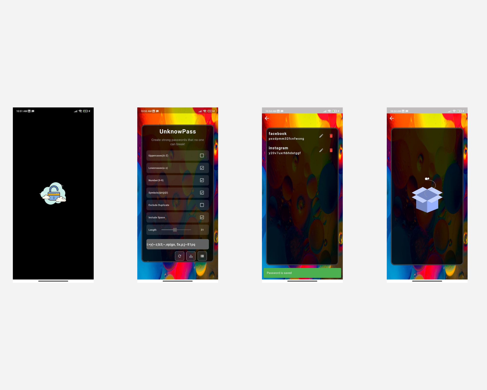

# LockMe - Password Generator App

This project is a Password Generator application developed using Flutter, designed to help users generate strong and secure passwords for their accounts and online activities. The app offers a user-friendly interface and customizable options for generating passwords with varying levels of complexity and length.

## Key Features:

#### Customizable Parameters
#### Secure Password Generation
#### Password Strength Indicator
#### Copy to Clipboard
#### Save and Manage Passwords
#### Dark Mode Support

## Technology Stack:

#### Frontend: Flutter
#### Database: sqflite
#### Randomization: Cryptographically secure random number generation
#### Persistence: Local storage for saving and managing generated passwords
#### Platform Compatibility: Android

## App Screens:

